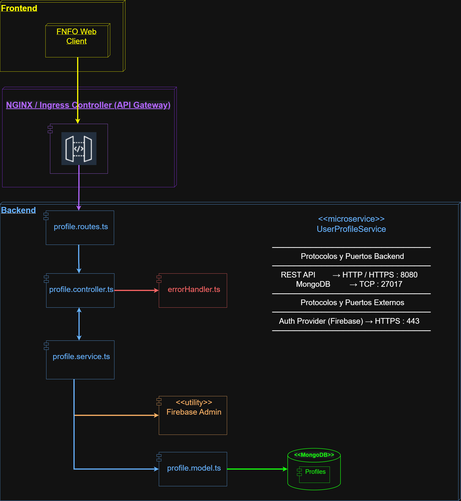
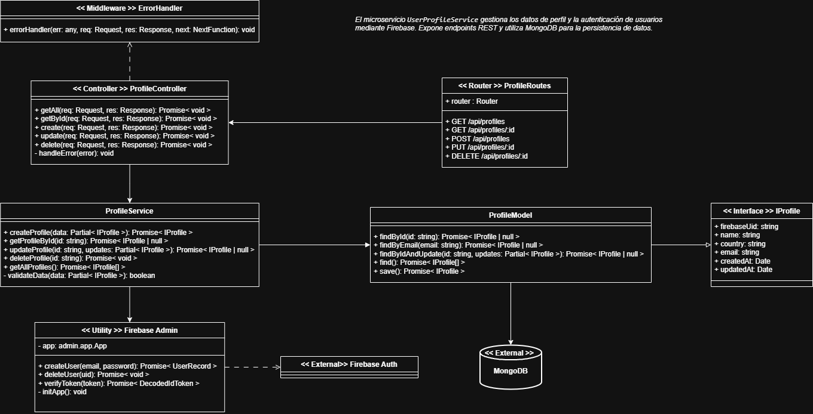
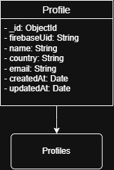

# 📘 FNFO - User Profile Service

**FNFO (Friday Night Funkin’ Online)** es una plataforma multijugador que permite a los jugadores competir o cooperar en tiempo real.  
Este microservicio se encarga de **gestionar los perfiles de usuario**, almacenar su información básica y servirla a otros servicios del ecosistema FNFO (por ejemplo, `MatchmakingService`, `LeaderboardService` y `GameService`).

---

## 🧩 Badges


---

## ⚙️ Tecnologías principales

| Componente | Tecnología |
|-------------|-------------|
| Lenguaje | TypeScript |
| Framework HTTP | Express.js |
| ODM | Mongoose |
| Logging | Morgan |
| CORS | cors |
| Variables de entorno | dotenv |
| Ejecución en caliente | ts-node-dev |

---

## 🚀 Configuración e instalación

### 1️⃣ Clonar el repositorio
```bash
git clone https://github.com/sebRedi/FNFO-UserProfileService.git
cd FNFO-UserProfileService
```

### 2️⃣ Instalar dependencias
```bash
npm install
```

### 3️⃣ Configurar variables de entorno
Crear un archivo llamado `.env` en la raíz del proyecto:

```
PORT=8080
MONGO_URI=mongodb://localhost:27017/user_profiles
FIREBASE_PROJECT_ID=fnfo-demo
```

> 💡 Si se usa MongoDB Atlas, reemplazar la URI por la cadena de conexión del cluster.

### 4️⃣ Ejecutar en modo desarrollo
```bash
npm run dev
```

---

## ✅ Verificación de funcionamiento

Si todo está correcto, se verá en consola:

```
MongoDB successfully connected
User Profile Service running on port 8080
```

Y al abrir en el navegador:
👉 [http://localhost:8080/api/profiles](http://localhost:8080/api/profiles)

Se recibirá:
```json
{ "message": "UserProfileService active" }
```

---

## 🧱 Estructura del proyecto

```
FNFO-UserProfileService/
├─ src/
│  ├─ app.ts                 # Configuración de middlewares y rutas principales
│  ├─ server.ts              # Punto de entrada y conexión a MongoDB
│  ├─ common/
│  │  └─ errorHandler.ts     # Middleware global de errores
│  ├─ config/                # Configuración global
│  ├─ profile/
│  │  ├─ profile.routes.ts
│  │  ├─ profile.controller.ts
│  │  ├─ profile.service.ts
│  │  └─ profile.model.ts
├─ .env                      # Variables de entorno
├─ package.json
├─ tsconfig.json
└─ README.md
```

---

## 🧩 Endpoints iniciales

| Método | Ruta | Descripción |
|--------|------|--------------|
| `GET` | `/api/profiles` | Verifica si el microservicio está activo |
| `GET` | `/api/profiles/:id` | Obtener perfil de usuario |
| `POST` | `/api/profiles` | Crear perfil |
| `PUT` | `/api/profiles/:id` | Actualizar perfil |
| `DELETE` | `/api/profiles/:id` | Eliminar perfil |

*(Los últimos endpoints se activarán al implementar el modelo y controlador.)*

---

## 🧠 Arquitectura general FNFO (contexto)

El **UserProfileService** forma parte del ecosistema **FNFO Backend**, desplegado en **Kubernetes (EKS – AWS)**.



---

## 🧠 Clases y datos del módulo




---

## 📦 Scripts útiles

| Comando | Descripción |
|----------|-------------|
| `npm run dev` | Ejecuta el servicio en modo desarrollo |
| `npm run build` | Transpila TypeScript a JavaScript |
| `npm start` | Ejecuta la versión compilada (producción) |

---

## 👥 Autores

| Nombre | Rol | GitHub |
|--------|-----|--------|
| **Sebastián Galvis Briceño** | Rol | [@sebRedi](https://github.com/sebRedi) |
| **Jeimy Yaya** | Rol | |
| **Nicolás Toro** | Rol | |
| **Juan David Zambrano** | Rol | |

---

## 📄 Licencia
Este proyecto está bajo la licencia **MIT**.
